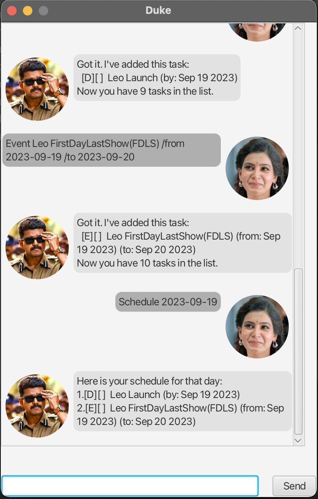

# IPS Vijaykumar Chatbot

IPS Vijaykumar ChatBot is a **desktop app for tracking tasks** using a sophisticated GUI(Graphic User Interface).

--------------------------------------------------------------------------------------------------------------------

## Quick start

1. Ensure you have Java `11` or above installed in your Computer.

1. Download the latest `duke.jar`.

1. Open a command terminal, `cd` into the folder you put the jar file in, and use the `java -jar duke.jar`
   command to run the application. 
   A GUI similar to the below should appear in a few seconds. Note how the app contains some sample data. 
   

1. Refer to the [Features](#features) below for details of each command.

--------------------------------------------------------------------------------------------------------------------

## Features

### 1) Adding tasks

You can add three types of tasks : `Todo`, `Deadline` and `Event`

1. Adding **todo** task : `todo DESCRIPTION`
2. Adding **deadline** task : `deadline DESCRIPTION /by DATE`
3. Adding **event** task: `event DESCRIPTION /from DATE /to DATE`

* DATE must be in the format {YYYY-MM-DD}
    * example: 2023-10-13

### 2) Listing all persons : `list`

Shows a list of all tasks in tasklist.

Format: `list`

### 3) Editing the tasklist with : `delete`

Deletes an existing task in the task list.

Format: `delete INDEX`

* Edits the task at the specified `INDEX`. The index refers to the index number shown in the displayed task list.
  The index **must be a positive integer** 1, 2, 3, …​

### 4) Locating tasks by description: `find`

Find tasks with description that contain any of the given keywords.

Format: `find KEYWORD`

### 5) Marking tasks : `mark`

Mark tasks to indicate if they are completed

Format: `mark INDEX`

* To unmark a task, use `unmark INDEX` instead
* To get the specific index number, use `list` command first

### 6) Viewing schedule : `schedule`

Discover Events and Deadlines of the day

Format: `schedule DATE`

* DATE must be in the format {YYYY-MM-DD}
    * example: 2023-10-13

### 7) Exiting the program : `bye`

Exits the program.

Format: `bye`

### Saving the data

Task data are saved into the duke.txt file automatically after any command that changes the data. There is no need to
save manually.

--------------------------------------------------------------------------------------------------------------------

## Command summary

 Action     | Format, Examples                                                                                                 
--------------|----------------------------------------------------------------------------------------------------------------
 **Add**      | `todo DESCRIPTION`   `deadline DESCRIPTION /by DATE`   `event DESCRIPTION /from DATE /to DATE` 
 **Mark**     | `mark INDEX`   `unmark INDEX`                                                                                 
 **Delete**   | `delete INDEX`  e.g., `delete 2`                                                                              
 **Tag**      | `tag INDEX #TAGNAME`   e.g.,`tag 2 #urgent`                                                                   
 **Find**     | `find KEYWORD`  e.g., `find homework2`                                                                        
 **List**     | `list`     
 **Schedule** | `schedule DATE`  
 **Exit**     | `bye`                                                                                                            
